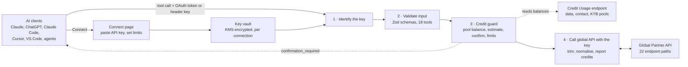
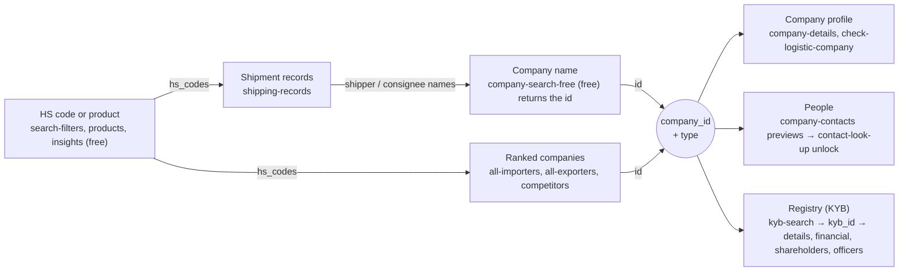
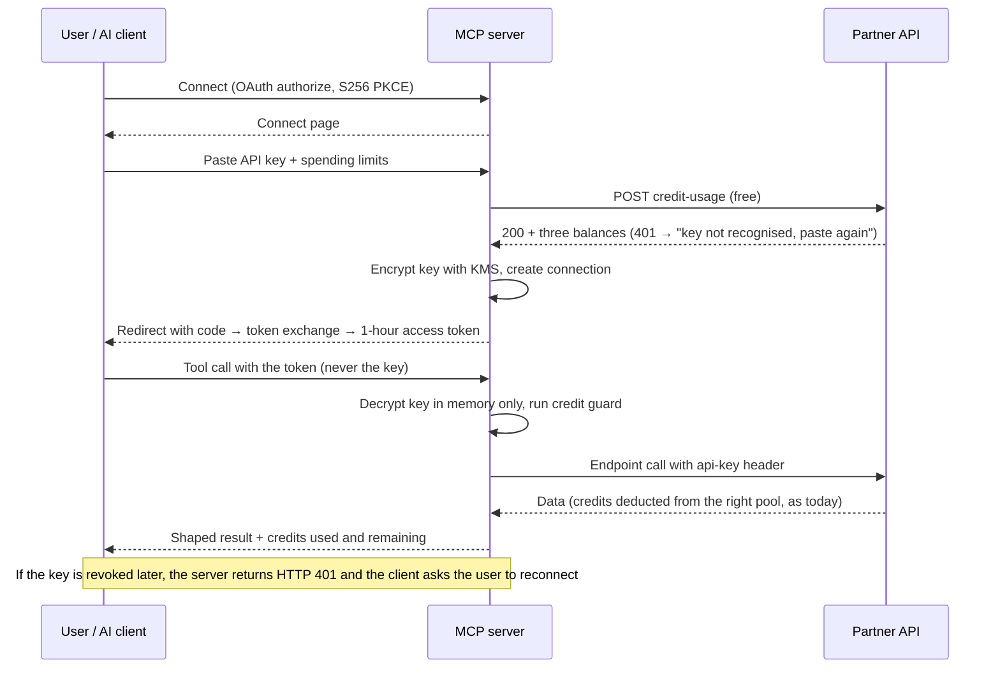

# Bill of Lading Data MCP Server — Build Brief (API Key Only, Global API)

Oct 8, 2026 · Bill of Lading Data

## Brief for Claude Code

Build and ship an MCP server that lets Bill of Lading Data customers use the **global API** inside ChatGPT, Claude and other AI tools, connecting with **only their existing API key** and paying the same credits they pay on the API today. Country-specific endpoints (`/partner-api/US/...`, `/partner-api/IN/...`) are out of scope.

**Scope: the 16 global API tabs**

Search Filters · Shipping Filters · Insights · Shipping Records · All Importers · All Exporters · Company Details · Company Search (Free and Advanced) · Company Contacts (Lite and Pro) · Contact Look Up · Check Logistic Company · Competitors · Products · KYB (Search, Details, Financial, Shareholders, Officers) · Credit Usage · Credit Usage Logs. Together these are **22 endpoint paths**, all under `https://tradedata.billofladingdata.com/partner-api/`.

**What you are building**

- A remote MCP server at `https://mcp.billofladingdata.com/mcp` (Streamable HTTP).
- A minimal OAuth 2.1 wrapper whose only "sign-in" is pasting a Bill of Lading Data API key (the Alpha Vantage pattern), which is what ChatGPT and the Claude directory require.
- Direct API-key access in a request header for developer tools, and a local stdio package (`npx @billofladingdata/mcp` with `BOLD_API_KEY`).
- 18 tools covering every global endpoint, a credit guard that uses the live balances from the Credit Usage endpoint, tests, deployment, docs and directory listings.

**Not in scope**

- Country-specific endpoints (US and India shipping records, India company details).
- User accounts, logins or any change to the platform's login system.
- Any change to credit prices; direct database access; an AI model or chat app.

**Definition of done**

1. A user can connect in Claude (web, desktop), ChatGPT (developer mode), Claude Code, Cursor and VS Code by pasting an API key or setting it in a header, and run all 18 tools.
2. Every paid call deducts the same credits from the same credit pool (data, contact or KYB) as the equivalent API call, and the result shows credits used and the pool's remaining balance.
3. No call spends more than the per-call limit without confirmation; contact and KYB unlocks always need confirmation.
4. API keys are never logged, never sent to the AI client, never in a URL, and stored only encrypted.
5. All tests pass in CI; production is deployed with monitoring and submitted to the MCP Registry and the Claude and ChatGPT directories.

**How to work**

- Read the whole brief, then create a `CLAUDE.md` recording the conventions in the repository section.
- Work through the milestones in order; do not start a milestone until the previous gate is met.
- Use the staging API and a test key; keep paid test calls to `page_size` 1–2 (under 500 credits per full run). Check spending with the Credit Usage Logs endpoint after each test run.
- Where this brief and the live API disagree, trust the live API, record the difference in `docs/api-notes.md`, and raise it with the team.
- Items marked **\[needs team input\]** are blocked until the team supplies them.

## Architecture at a glance

One server hosts the connect page, keeps each connection's API key encrypted, checks every call against the right credit pool and the user's limits, then calls the global Partner API with the key.



The Partner API charges credits exactly as today. The credit guard reads live balances from the free Credit Usage endpoint and only decides whether a call may go ahead.

## Global API at a glance

The global API has 16 documentation tabs and 22 endpoint paths: 9 are free and 13 charge credits from one of three pools (data, contact, KYB). Every call is `POST https://tradedata.billofladingdata.com/partner-api/<path>` with a JSON body and an `api-key` header, returning `{ "code", "message", "data" }`. Read on 8 Oct 2026 from the [API documentation page](https://tradedata.billofladingdata.com/supplier/api-documentation?tab=documentation).

| # | Tab | Path | Cost | Credit pool | Rate limits | Max page |
| --- | --- | --- | --- | --- | --- | --- |
| 1 | Search Filters | `search-filters` | Free | — | — | — |
| 2 | Shipping Filters | `shipping-filters` | Free | — | — | — |
| 3 | Insights | `insights` | Free | — | — | — |
| 4 | Shipping Records | `shipping-records` | 1 per record | Data | — | 250 |
| 5 | All Importers | `all-importers` | 15 per record | Data | — | 250 |
| 6 | All Exporters | `all-exporters` | 15 per record | Data | — | 250 |
| 7 | Company Details | `company-details` | 20 per company | Data | — | — |
| 8a | Company Search — Free | `company-search-free` | Free | — | 30/min, 450/hr, 1,500/day | 250 |
| 8b | Company Search — Advanced | `company-search` | 15 per record | Data | — | 250 |
| 9a | Company Contacts — Lite | `company-contacts` | Free | — | 10/min, 150/hr, 25,000/month | 250 |
| 9b | Company Contacts — Pro | `advanced-company-contacts` | 2 per page | Contact | 75/min, 500/hr, 150,000/month | 50 |
| 10 | Contact Look Up | `contact-look-up` | Professional email 10, personal email 10, phone 15, per person | Contact | — | — |
| 11 | Check Logistic Company | `check-logistic-company` | Free | — | — | — |
| 12 | Competitors | `competitors` | 15 per record | Data | — | 250 |
| 13 | Products | `products` | Free | — | — | 250 |
| 14a | KYB — Search | `kyb-search` | 3 per search | KYB | — | — |
| 14b | KYB — Details | `advanced-kyb-search` | 10 per request | KYB | — | — |
| 14c | KYB — Financial | `financial-kyb` | 10 per request | KYB | — | — |
| 14d | KYB — Shareholders | `shareholders-kyb` | 10 per request | KYB | — | 100 |
| 14e | KYB — Officers | `officers-kyb` | 10 per request | KYB | — | 100 |
| 15 | Credit Usage | `credit-usage` | Free | — | — | — |
| 16 | Credit Usage Logs | `credit-usage-logs` | Free | — | — | 250 |

**Shared rules**

- `type` is `imp` or `exp`; country codes are 2-letter ISO; dates are `YYYY-MM-DD`, and `bydate` in responses is `YYYYMMDD`.
- `date_range` may not exceed 12 months and defaults to the last 12 months.
- Range filters: `weight {unit, min, max}`, `quantity {unit, min, max}`, `import_value {min, max}`.
- `transport_types`: sea, land, air, postal, railway, pipeline, power transmission, other.
- Status codes: 200, 400, 401 (bad key), 402 (out of credits), 403, 404, 500. No 429 is documented, although several endpoints have rate limits.
- Credits are charged per record returned (per page for Contacts Pro, per request for KYB), and only when data is returned. Failed or empty calls are never charged (confirmed by the team).

## Endpoint analysis

The 16 tabs fall into five groups: discovery (free filters, insights, products), trade records and rankings (paid, data credits), company lookups, contacts (contact credits) and KYB (KYB credits), plus two free account endpoints. Read every tab in full before writing schemas; this table records what each endpoint needs, what it returns, and how the server should use it.

**Discovery — free**

| Endpoint | Required | Optional | Key outputs | How the MCP uses it |
| --- | --- | --- | --- | --- |
| Search Filters | `type`; one of `company_id`, `hs_codes[]`, `products[]` | — | `hs_codes`, `import_countries`, `export_countries`, `loading_ports`, `unloading_ports` (each `{label, label_cn, value}`); `import_value`, `export_value`, `total_shipments` ranges; `quantities`, `weights` by unit | Turn the user's words into valid filter values before any paid call. Use `value`, not `label`. |
| Shipping Filters | Same as Search Filters | — | Same plus `importer_names`, `exporter_names` (strings), `transport_types`, `bill_of_lading_nbrs` | Same tool with `include_parties=true`, when the user wants named parties or transport modes. Arrays may be empty; ranges may include zero or negatives. |
| Insights | `type`; one of `company_id`, `hs_codes[]`, `products[]` | `date_range`, `import_countries[]`, `export_countries[]`, `import_value`, `weight`, `transport_types[]` | `import_summary` (total value, shipments, quantity, weight, importers, suppliers, countries, ports, HS codes); `top_10_importer_countries`; `top_10_exporter_countries` | The default first call for market-size and "who trades this" questions. Free, so prefer it over paid lists. |
| Products | `type`, `page_size`, `page_no`; one of `company_id`, `hs_codes[]`, `products[]` | Same filters as Insights | `name` (long product text), `hs_code`, `total_shipments`, `total_import_value`, `total_import_quantity` | Map product words to HS codes; see what a company trades. Truncate `name`. The response field descriptions in the docs are copied from Competitors — ignore them. |

**Trade records and rankings — data credits**

| Endpoint | Required | Optional | Key outputs | How the MCP uses it |
| --- | --- | --- | --- | --- |
| Shipping Records | `type`, `page_size`, `page_no`; one of `company_ids[]`, `hs_codes[]`, `products[]`, `bill_of_lading_nbrs[]` | `date_range`, countries, `weight`, `quantity`, `import_value`, `loading_ports[]`, `unloading_ports[]`, `importer_names[]`, `exporter_names[]`, `transport_types[]` | 27 fields per shipment incl. `bydate`, `hs_code`, country codes and names, `amount`, `manifest_qty`, `weight`, `export_id`, `shipper_name`, `import_id`, `consignee_name`, `products`, ports, `bill_of_lading_nbr`, `brands` | Shipment-level detail and B/L lookup. `company_ids` is an array here, unlike other endpoints. `import_id` and `export_id` are record ids, **not** company ids: to find the company behind a shipment, pass `shipper_name` or `consignee_name` to `find_company_id`. Default `page_size` 10. |
| All Importers | `page_size`, `page_no`; one of `company_id`, `hs_codes[]`, `products[]` | `date_range`, countries, `weight`, `import_value`, `transport_types[]` | `rank`, `id`, `name`, `domain`, `country`, totals (value, shipments, quantity, weight), `total_suppliers`, countries, ports, sample `products` | Ranked buyer lists. Don't send `type`: this endpoint returns importers only (confirmed by the team). |
| All Exporters | Same as All Importers | Same | Same with `total_export_value`, `total_export_quantity`, `total_buyers` | Ranked supplier lists. Don't send `type`: this endpoint returns exporters only. |
| Competitors | `type`, `company_id`, `page_size`, `page_no` | — | `id`, `name`, `domain`, `country`, `no_of_shipments` | Similar market players for a company id. Default `page_size` 5. |

**Company lookups**

| Endpoint | Cost | Required | Key outputs | How the MCP uses it |
| --- | --- | --- | --- | --- |
| Company Search — Free | Free; 30/min, 450/hr, 1,500/day | `type`, `company_name`, `page_size`, `page_no` (optional `countries[]`, `date_range`) | `id`, `name`, `domain`, `country` only | **The default way to turn a name into a company id.** Free, so use it before anything paid. |
| Company Search — Advanced | 15 data credits per record | Same | Adds `total_shipments`, `total_import_value` | Only when the user wants trade totals for many name matches. |
| Company Details | 20 data credits | `type`, `company_id` | Profile: name, country, domain, tags, `contact_info`, `social_links`, totals, countries, ports, `industry_classifications` (HS, NAICS, SITC), `is_logistics_company` | Full profile of one chosen company. |
| Check Logistic Company | Free | `type`, `company_id` | `is_logistics_company` | Check whether a buyer or supplier is really a freight forwarder before paying for its profile or contacts. |

**Contacts — contact credits**

| Endpoint | Cost | Required | Key outputs | How the MCP uses it |
| --- | --- | --- | --- | --- |
| Company Contacts — Lite | Free; 10/min, 150/hr, 25,000/month | `page_size`, `page_no`; `company_id` (+`type`) or `company_name`; optional `roles[]` (All, Founder, Chairman, Chief, Vice President, Director, Manager) | Masked previews: contact `id`, `name`, `position`, `company`, `country_code`, `linkedin_url`, `teaser` (which emails and phones exist, with counts) | Default contact discovery. Never shows full emails or phones. |
| Company Contacts — Pro | 2 credits per page; 75/min, 500/hr, 150,000/month; max 50 per page | Same as Lite | Same as Lite | Only when Lite's rate limit is reached or the user asks for many companies. |
| Contact Look Up | Professional email 10, personal email 10, phone 15, per person; charged only when returned | `lookup_type[]`; one of `contact_id`, `name`, `email`, `phone` (optional `company_name`) | Profile plus `professional_emails`, `personal_emails`, `phones` (emails only when verified A or A-) | Unlock tool, always behind confirmation. Use `contact_id` from Lite or Pro. |

**KYB — KYB credits**

| Endpoint | Cost | Required | Key outputs | How the MCP uses it |
| --- | --- | --- | --- | --- |
| KYB Search | 3 per search (KYB pool) | `company_id` + `type`, or `company_name` + `country_code` | Array of `{id, name, registration_number, vat_number, country_code, state, jurisdiction}` | Find the registry record; its `id` becomes `kyb_id`. Paid (3 credits), so call it only when the user wants KYB information. |
| KYB Details | 10 | `kyb_id` | Registration, status, incorporation date, address, legal form, website, ticker | Unlock tool section `details`. Path `advanced-kyb-search` confirmed by the team: pass the `kyb_id` from KYB Search. |
| Financial KYB | 10 | `kyb_id` | `years[]` and `groups[]` of line items keyed by year | Section `financials`; reshape into a year-by-item table. |
| Shareholders KYB | 10 | `kyb_id` (optional `page_size` ≤ 100, `page_no`) | Name, percentage, quantity, share type, value, verified date | Section `shareholders`. |
| Officers KYB | 10 | `kyb_id` (optional paging ≤ 100) | Name, job title, appointed and resigned dates, status, address fields | Section `officers`; drop date-of-birth fields from results. |

**Account — free**

| Endpoint | Required | Key outputs | How the MCP uses it |
| --- | --- | --- | --- |
| Credit Usage | none (empty body) | `credits.data_credits`, `contact_credits`, `kyb_credits`, each `{total, used, remaining}`; `usage` counts per action | **Validates a pasted key** (200 = valid) and gives live balances for the credit guard and results. |
| Credit Usage Logs | optional `page_size` (≤ 250), `page_no`, `credit_type`, `action` | Charges newest first: `id`, `credit_type`, `action`, `credits_used`, `created_at` | Lets users see what the AI spent; used in tests to reconcile credits. |

## How the endpoints chain

Most questions need a `company_id` (plus `type`) before any company, contact or KYB tool can run, and the new free Company Search endpoint is the cheapest way to get one.



Shipment `import_id` / `export_id` are record ids, **not** company ids (confirmed): use the names to find the company.

Credit Usage and Credit Usage Logs sit outside this chain: they need only the API key and are used by the credit guard, the connect page and the `my_usage` prompt.

## Connection flow

The user pastes their API key once; the server checks it with the free Credit Usage endpoint and stores it encrypted, and the AI client only ever holds a short-lived token.



In header mode (Claude Code, Cursor, VS Code, agents) the top row is skipped: the client sends the API key with each request, and nothing is stored.

## Target AI clients

Two ways in, both ending at the same API key: clients that accept a header send the key directly; clients that require OAuth (ChatGPT, directory listings) use the paste-your-key page. Target MCP specification 2026-07-28 and stay compatible with clients on 2025-11-25 and 2025-06-18.

| Client | How the user connects | Key delivered by | Notes for the build |
| --- | --- | --- | --- |
| Claude (web, desktop, mobile) | Customize → Connectors → Add custom connector → URL → Connect; later the Connectors Directory | Paste-your-key page, or request header (beta) | Register redirect URI `https://claude.ai/api/mcp/auth_callback`; OAuth endpoints answer within 10 s; Claude traffic comes from `160.79.104.0/21`. |
| Claude (Team, Enterprise) | Owner adds it in Organization settings → Connectors; each member clicks Connect and pastes their own key | Paste-your-key page | Each member spends their own account's credits. |
| Claude Code | `claude mcp add --transport http bold https://mcp.billofladingdata.com/mcp --header "Authorization: Bearer YOUR_API_KEY"`, the paste flow, or `claude mcp add bold -- npx @billofladingdata/mcp` with `BOLD_API_KEY` | Header, paste page, or environment | Paste flow uses a loopback redirect: accept `http://localhost/callback` and `http://127.0.0.1/callback` on any port. |
| ChatGPT | Developer mode → add MCP server by URL → Connect; later the app directory | Paste-your-key page only (no API keys or custom headers) | Streamable HTTP only; tool metadata is frozen at approval; use ChatGPT's redirect URI from OpenAI's current docs. |
| Cursor, VS Code, Windsurf, Gemini CLI | `mcp.json` with the URL and an `Authorization` header, or the stdio package | Header or environment | Copy-paste config for each in `docs/clients/`. |
| Agent frameworks | URL plus `Authorization: Bearer <api_key>` | Header | Snippets for the OpenAI Agents SDK and Claude Agent SDK. |

Never accept the key in the URL (`?apikey=`): Alpha Vantage has deprecated it, Claude's documentation advises against it, and URLs end up in logs.

## Tool catalogue

18 tools cover all 22 global endpoint paths: 9 free, 7 paid, and 2 unlock tools that always need confirmation. Near-duplicate endpoints sit behind one tool (the two filter endpoints, Lite and Pro contacts, the four paid KYB sections). Names are `snake_case`; every input has a Zod schema exported as JSON Schema; every tool returns `structuredContent` matching a declared `outputSchema`, plus a short text summary.

**Shared input: `TradeFilter`** — `type` (`imp`|`exp`, required) · `hs_codes[]` · `products[]` · `company_id` · `date_range {start_date, end_date}` (≤ 12 months) · `import_countries[]` · `export_countries[]` · `import_value {min, max}` · `weight {unit, min, max}` · `transport_types[]`. The server checks "at least one of hs\_codes, products, company\_id" before calling the API.

**Free tools (9)**

| Tool | Endpoint(s) | Key inputs | Returns |
| --- | --- | --- | --- |
| `get_filter_options` | search-filters; shipping-filters when `include_parties=true` | `type`, `hs_codes[]`, `products[]`, `company_id`, `include_parties` | Valid HS codes, countries, ports, value/weight/quantity ranges, party names |
| `get_market_insights` | insights | `TradeFilter` | Market totals, top 10 importer and exporter countries |
| `search_products` | products | `TradeFilter`, `page_size` (default 10) | Product text, HS code, shipments, value, quantity |
| `find_company_id` | company-search-free | `type`, `company_name`, `countries[]`, `page_size` (default 10) | Company id, name, domain, country |
| `check_logistics_company` | check-logistic-company | `type`, `company_id` | `is_logistics_company` |
| `find_company_contacts` | company-contacts (Lite); advanced-company-contacts (Pro, 2 contact credits per page) when `volume="pro"` | `company_id`+`type` or `company_name`, `roles[]`, `page_size` (default 10; Pro max 50) | Masked previews with contact ids and which details exist |
| `get_credit_balance` | credit-usage | none | Data, contact and KYB credits: total, used, remaining |
| `get_credit_history` | credit-usage-logs | `credit_type`, `action`, `page_size` (default 20) | Recent charges, newest first |
| `estimate_cost` | none (local) | tool name + arguments | Maximum credits and which pool, with the current remaining balance |

All free tools are annotated readOnly and idempotent, except `find_company_contacts` in Pro mode (it spends contact credits).

**Paid tools (7)**

| Tool | Endpoint | Key inputs | Credits | Pool | Default / max page |
| --- | --- | --- | --- | --- | --- |
| `search_shipments` | shipping-records | `TradeFilter` (with `company_ids[]`), `bill_of_lading_nbrs[]`, `quantity`, `loading_ports[]`, `unloading_ports[]`, `importer_names[]`, `exporter_names[]` | 1 per record | Data | 10 / 50 |
| `list_importers` | all-importers | `TradeFilter` without `type` (importers only) | 15 per record | Data | 10 / 50 |
| `list_exporters` | all-exporters | `TradeFilter` without `type` (exporters only) | 15 per record | Data | 10 / 50 |
| `search_companies` | company-search (Advanced) | `type`, `company_name`, `countries[]`, `date_range` | 15 per record | Data | 5 / 50 |
| `find_competitors` | competitors | `type`, `company_id` | 15 per record | Data | 5 / 50 |
| `get_company_profile` | company-details | `type`, `company_id` | 20 | Data | — |
| `search_kyb` | kyb-search | `company_id` + `type`, or `company_name` + `country_code` | 3 per search | KYB | — |

Paid tools are annotated readOnly and openWorld, and take optional `max_credits` and `confirmation_token`. The description of `search_companies` must say "Use find\_company\_id (free) if you only need the id."

**Unlock tools (2) — always need confirmation**

| Tool | Endpoint(s) | Key inputs | Credits | Pool |
| --- | --- | --- | --- | --- |
| `reveal_contact_details` | contact-look-up | `contact_id`, `lookup_type[]` (professional\_emails, personal\_emails, phones), `confirmation_token` | 10 / 10 / 15 per person, only when returned | Contact |
| `get_kyb_report` | advanced-kyb-search, financial-kyb, shareholders-kyb, officers-kyb | `kyb_id`, `sections[]` (details, financials, shareholders, officers), `confirmation_token` | 10 per section | KYB |

Unlock tools are annotated `readOnlyHint: true`, `destructiveHint: false`, `idempotentHint: true`, `openWorldHint: true`: they reveal data but change nothing. This keeps them available to every ChatGPT plan (non-read-only tools count as plan-limited write actions there). Safety comes from the server instead: every unlock **always** needs the user's confirmation (elicitation or `confirmation_token`) and respects the connection's allow switches, whatever the client shows.

**Description rules**: first line states the cost and pool ("Costs 15 data credits per company returned"); say which tool to call first (free before paid; `find_company_id` before anything needing a `company_id`); never describe a field the tool does not return; keep each description under 1,000 characters.

## Credits and cost controls

Credits work exactly as today: the Partner API deducts them from the key's account, in three separate pools. The server's job is to stop an AI client spending more than the user intended, using live balances from the free Credit Usage endpoint.

**Cost table** — one file, `src/billing/costs.ts`, loaded from config so prices can change without a code change.

| Tool | Worst-case credits for a call | Pool |
| --- | --- | --- |
| Free tools | 0 | — |
| `find_company_contacts` with `volume="pro"` | 2 per page | Contact |
| `search_kyb` | 3 | KYB |
| `search_shipments` | `page_size` × 1 | Data |
| `list_importers`, `list_exporters`, `search_companies`, `find_competitors` | `page_size` × 15 | Data |
| `get_company_profile` | 20 | Data |
| `reveal_contact_details` | 10 per email type + 15 for phones, per person | Contact |
| `get_kyb_report` | 10 × number of sections | KYB |

**Before each paid call**

1. Compute the worst-case cost and its pool.
2. Read the pool's `remaining` from Credit Usage (cache it for 60 seconds per key). If the cost exceeds what remains, return a clear "not enough data credits — you have 120 left" result without calling the API.
3. If the cost is within the connection's per-call limit (default 150) and the tool is not an unlock tool, call the API.
4. Otherwise don't call it. If the client supports MCP elicitation, ask the user directly; if not, return `status: "confirmation_required"` with the estimate, the pool balance and a `confirmation_token`.
5. The `confirmation_token` is signed, single-use, bound to the connection, tool and exact arguments, valid for 10 minutes, and stored in Redis.
6. Unlock tools always go through step 4.

**After each paid call**

- `credits_used`: records returned × unit cost (per page for Contacts Pro, per section for KYB), labelled `estimated`.
- `credits_remaining`: refresh the pool from Credit Usage and report it.
- `total`, `page_no`, `has_more`, and the cost of the next page.
- Nightly job: compare the server's estimates with Credit Usage Logs for a sample of keys and alert on any mismatch.

**Spending settings per connection**

| Setting | Default | Where it is set |
| --- | --- | --- |
| Per-call limit | 150 credits | Connect page, or `X-Bold-Max-Credits` header |
| Daily limit for this connection | 2,000 credits (all pools) | Connect page, or `X-Bold-Daily-Credits` header |
| Allow contact unlocks | On | Connect page, or `X-Bold-Allow-Contacts: false` |
| Allow KYB unlocks | On | Connect page, or `X-Bold-Allow-KYB: false` |

**Never**: auto-paginate a paid tool; retry a call more than twice (failed or empty calls are never charged, so up to two retries on 429, 5xx or timeouts are safe); call an unlock endpoint without a valid confirmation.

## API-key sign-in

The MCP server is its own small OAuth 2.1 authorization server whose only "login" is a page where the user pastes their Bill of Lading Data API key. Clients get the standard OAuth flow they require; Bill of Lading Data needs no user database or login integration.

**Endpoints to build** (all on `https://mcp.billofladingdata.com`)

| Endpoint | Purpose and requirements |
| --- | --- |
| `GET /.well-known/oauth-protected-resource` and `/.well-known/oauth-protected-resource/mcp` | RFC 9728: `resource` exactly `https://mcp.billofladingdata.com/mcp`; `authorization_servers: ["https://mcp.billofladingdata.com"]`; `scopes_supported: ["bold"]` |
| `GET /.well-known/oauth-authorization-server` | RFC 8414: authorize, token, register and revoke URLs; `code_challenge_methods_supported: ["S256"]`; `client_id_metadata_document_supported: true`; `token_endpoint_auth_methods_supported: ["none"]`; `grant_types_supported: ["authorization_code", "refresh_token"]`; `authorization_response_iss_parameter_supported: true` |
| `POST /register` | Dynamic client registration (RFC 7591) as a fallback for clients without CIMD |
| `GET /authorize` | Shows the connect page. Accepts CIMD `client_id` URLs (fetch and validate the metadata) and registered client ids; checks `redirect_uri`; requires S256 `code_challenge` and the `resource` parameter |
| `POST /authorize` | Validates the key, stores it encrypted, creates the connection, issues a one-time code bound to the PKCE challenge, redirects with `code`, `state` and `iss` |
| `POST /token` | Form-urlencoded; exchanges code + `code_verifier` or a refresh token; access token 1 hour, rotating refresh token 90 days; `invalid_grant` for dead tokens; under 2 seconds |
| `POST /revoke` | RFC 7009 revocation; revokes the connection |
| `/mcp` | Without a valid token or key: HTTP 401 with `WWW-Authenticate: Bearer resource_metadata="https://mcp.billofladingdata.com/.well-known/oauth-protected-resource", scope="bold"` |

**The connect page**

- Logo and "Connect *{client name}* to Bill of Lading Data", with the redirect host shown clearly.
- One password-style field, "Paste your API key", with links "Where do I find my API key?" and "No key? Start the free trial (1,000 API credits)".
- Spending settings: per-call limit, daily limit, allow contact unlocks, allow KYB unlocks.
- "Your key is stored encrypted and used only to call the Bill of Lading Data API for this connection. Disconnect any time."
- After a successful check, show the three balances from Credit Usage (data, contact, KYB) so the user sees which account they connected.
- Server-rendered HTML, no third-party scripts, CSRF token, 5 attempts per 15 minutes per IP.

**Validating the key** — call `POST /partner-api/credit-usage` (free) with the key. 200 → accept and show balances; 401 → "Key not recognised"; 200 with all balances zero → accept but warn "This account has no API plan or credits".

**Storing keys and tokens**

| Item | How it is stored |
| --- | --- |
| API key | AES-256-GCM envelope encryption with a KMS-managed key; decrypted only in memory for each API call |
| Key fingerprint | First 12 characters of the key's SHA-256, for logs and support |
| Access and refresh tokens | Opaque 256-bit random strings with prefix `boldmcp_`; only SHA-256 hashes stored |
| Connection | id, encrypted key, fingerprint, client id and name, spending settings, created, last used, revoked |

Re-use of an already-rotated refresh token revokes the whole connection.

**Header mode** — accept `Authorization: Bearer <api_key>` or `api-key: <api_key>` on `/mcp`; values starting with `boldmcp_` are OAuth tokens, anything else is an API key. Validate a new key with Credit Usage and cache the result for 5 minutes by fingerprint; nothing is stored.

**Rotation and revocation** — to change keys, disconnect and reconnect; if the Partner API returns 401 for a stored key, mark the connection invalid and return HTTP 401 so the client re-runs Connect; connections unused for 90 days expire; an admin command revokes every connection for a key fingerprint.

**Spec compliance** — the OAuth token never leaves the MCP server; the server calls the Partner API with the stored API key, so there is no token passthrough.

## Response shaping, resources and prompts

AI clients pay for every token they read, so results should be compact, typed and predictable. Shape every API response in `src/shaping/` before returning it.

**Shaping rules**

- Drop Chinese-label fields (`*_cn`, `label_cn`) unless the tool is called with `language: "zh"`.
- Normalise types: dates to ISO `YYYY-MM-DD`; numeric strings to numbers; `""`, `"-"` and `null` all to `null`.
- Truncate free-text product descriptions (Products `name`, Shipping Records `products`, importer/exporter `products`) to 200 characters and add `products_truncated: true`.
- Reshape Financial KYB from `years[]` × `groups[]` into one table per group with a column per year.
- Drop officer date-of-birth fields and contact `profile_pic` from results.
- Return rows plus `total`, `page_no`, `page_size`, `has_more`, `next_page_cost_credits`, `credits_used`, `credits_remaining` (pool).
- Keep company ids, contact ids and `kyb_id` so the AI can chain tools. Label `import_id` and `export_id` as record ids so the AI never passes them as a `company_id`.
- Add `source: "Bill of Lading Data"` to every result. Free text from the data goes in data fields only, never into the summary.

**Server instructions** (in the MCP `initialize` response): use free tools first (`get_market_insights`, `get_filter_options`, `search_products`, `find_company_id`); state credits used and remaining after each paid call; ask the user before any call that returns `confirmation_required`; never call unlock tools unless the user asked for contact or KYB details; cite Bill of Lading Data as the source.

**Resources** (read-only, free)

| URI | Content |
| --- | --- |
| `bold://pricing` | The cost table and the three credit pools, in plain words |
| `bold://reference/countries` | Country codes and names |
| `bold://reference/transport-types` | Allowed transport values |
| `bold://reference/contact-roles` | Allowed `roles` values for contacts |
| `bold://guide/workflows` | Which tools to chain for common questions |

**Prompts**

| Prompt | Arguments | Tool chain |
| --- | --- | --- |
| `find_buyers` | product or HS code, target country | get\_market\_insights → list\_importers → check\_logistics\_company → find\_company\_contacts |
| `find_suppliers` | product or HS code, origin country | get\_market\_insights → list\_exporters → get\_company\_profile |
| `market_size` | product or HS code, country, period | search\_products → get\_market\_insights |
| `supplier_due_diligence` | company name, country | find\_company\_id → get\_company\_profile → search\_kyb → get\_kyb\_report (with confirmation) |
| `competitor_scan` | company name | find\_company\_id → find\_competitors → get\_market\_insights |
| `my_usage` | period | get\_credit\_balance → get\_credit\_history |

## Repository layout, tech stack and coding rules

One TypeScript monorepo: a shared core with all 18 tools, a remote HTTP server that also hosts the API-key sign-in, and a stdio package, so every client gets identical tools.

**Layout**

```
bold-mcp/
  CLAUDE.md                  # conventions from this section, kept current
  packages/
    core/
      src/client/            # Partner API client for the 22 global paths: api-key header, timeouts, retries, error mapping
      src/schemas/           # Zod input/output schemas, one file per tool
      src/tools/             # one file per tool: definition, handler, description
      src/billing/           # costs.ts, pools, estimator, balance cache, confirmation tokens, limits
      src/shaping/           # response normalisers (incl. Financial KYB reshaping)
      src/resources/  src/prompts/
      src/server.ts          # builds the McpServer and registers everything
    http-server/
      src/mcp/               # Streamable HTTP transport, sessions, rate limits
      src/auth/              # header-mode keys, token checks, 401 challenge
      src/oauth/             # metadata, /register, /authorize, /token, /revoke, CIMD fetcher
      src/oauth/views/       # connect page (server-rendered HTML + CSS)
      src/vault/             # KMS envelope encryption for stored API keys
      src/db/                # migrations: connections, clients, tokens, usage_log
      src/index.ts
    stdio/                   # npm: @billofladingdata/mcp (reads BOLD_API_KEY)
  test/  unit/ contract/ oauth/ e2e/ fixtures/
  docs/  clients/ api-notes.md tools.md
  infra/                     # Dockerfile, deploy config, dashboards, alerts
  server.json                # MCP Registry metadata
```

**Stack**

| Layer | Choice |
| --- | --- |
| Runtime | Node.js current LTS, TypeScript strict, ES modules |
| MCP | Official `@modelcontextprotocol/sdk` (latest stable), Streamable HTTP and stdio |
| Validation | Zod, converted to JSON Schema |
| HTTP | Express or Hono with the SDK's Node integration |
| OAuth | Minimal hand-written server; `jose` for signed confirmation tokens; standard crypto for random tokens; no third-party identity provider |
| Database | PostgreSQL: connections, OAuth clients, token hashes, usage log |
| Cache and state | Redis: confirmation tokens, rate limits, balance cache, key-validity cache |
| Secrets | Cloud KMS for the key-encryption key; secrets manager for config |
| Logging and metrics | pino, OpenTelemetry |
| Tests | Vitest, msw, Playwright (connect page), MCP Inspector CLI |
| CI | GitHub Actions: lint, typecheck, unit, contract, OAuth, build, image scan |

**Coding rules**

- One tool per file; description, schemas and handler together.
- No `any`; every API response parsed with Zod; unknown fields dropped.
- All credit maths and pool mapping in `billing/`, covered by unit tests.
- API keys exist in plaintext only inside the request that uses them; a lint rule blocks logging variables named `apiKey`, `key` or `token`.
- Config from environment variables, validated at start-up.
- Log every tool call with tool, connection id, key fingerprint, pool, credits estimated, latency and outcome — never personal data from arguments or results.
- Conventional commits; update `docs/tools.md` whenever a tool changes.

## Errors, rate limits, security and privacy

With API keys stored on the server, key protection is the top security requirement; errors must tell the AI what to do next.

**Error mapping**

| Situation | What the server returns |
| --- | --- |
| No token or key, or invalid/expired OAuth token | HTTP 401 with the `WWW-Authenticate` challenge |
| Stored key rejected by the Partner API (401) | Mark the connection invalid; HTTP 401 so the client re-runs Connect |
| Header-mode key rejected (401) | Tool error: "API key not recognised — check the key in your client settings" |
| API 400 | `isError: true` with the exact field to fix, e.g. "date\_range exceeds 12 months" |
| API 402, or pool balance too low (pre-checked) | Tool error naming the pool and balance: "Not enough contact credits (40 left) — top up at …" |
| API 403 | Tool error: "This API key doesn't have access to this data — contact Bill of Lading Data" |
| API 404 | Tool error: "No company with that id — run find\_company\_id first" |
| API 429 or 5xx | Retry twice with jittered backoff (free and paid — failed calls are never charged), then a tool error |
| Over limit, or unlock | Normal result with `status: "confirmation_required"` |
| API slower than 25 s | Tool error suggesting a narrower filter |

**Rate limits**

- Per connection (or key fingerprint in header mode): 60 tool calls per minute, 5 concurrent.
- Upstream limits enforced locally per key, so the API is not hit when a limit is known to be reached:
  - Company Search Free: 30/min, 450/hr, 1,500/day — when exhausted, tell the user and offer `search_companies` (paid).
  - Contacts Lite: 10/min, 150/hr, 25,000/month — when exhausted, offer Pro mode (2 contact credits per page).
  - Contacts Pro: 75/min, 500/hr, 150,000/month.
- Connect page and `/token`: per-IP limits to stop key guessing.

**Key and token security**

- Keys encrypted at rest with KMS envelope encryption; plaintext never written to disk, logs, error reports or traces; never returned to any client; never accepted in a URL.
- Access tokens checked for audience and expiry on every request; refresh tokens rotate; reuse of an old refresh token revokes the connection.
- Validate `Origin` on `/mcp`; bind sessions to the connection; random session ids.
- CIMD fetcher: HTTPS only, 5-second timeout, size limit, no private-IP targets.
- Treat API text as untrusted (prompt injection): data stays in data fields; tool descriptions are static.
- Dependency and image scanning in CI; TLS everywhere; allow Claude's egress range `160.79.104.0/21` and ChatGPT's published ranges through any WAF.

**Privacy**

- Contact and KYB results are personal data: unlock only with confirmation; audit-log each unlock (connection, key fingerprint, contact or KYB id, time); never log revealed details.
- Privacy notice and terms updated to cover storing API keys for AI connections and sending results to the customer's chosen AI provider **\[needs team input\]**.

## Testing and acceptance

Unit, contract, protocol and OAuth tests run in CI on every pull request; live and client tests run before each release, with spending checked against Credit Usage Logs.

| Layer | What it covers | Tooling | When |
| --- | --- | --- | --- |
| Unit | Schemas, cost estimator and pool mapping, balance cache, confirmation tokens, limits, shaping, error mapping, key encryption | Vitest | Every PR |
| Contract | All 22 endpoint paths against recorded staging responses, including empty results, 400, 401, 402, 404, 500 | Vitest + msw | Every PR |
| Protocol | `initialize`, `tools/list` (18 tools), `tools/call`, resources, prompts, version negotiation, sessions | MCP Inspector CLI | Every PR |
| OAuth | 401 challenge, both metadata documents, CIMD and DCR, S256 PKCE, `resource` check, `iss`, single-use codes, refresh rotation and reuse detection, `invalid_grant`, revoke, `/token` latency | Scripted tests | Every PR |
| Connect page | Valid key (balances shown), wrong key, zero-balance key, CSRF, rate limit, redirect host shown, settings saved | Playwright | Every PR |
| Key safety | Run every tool and the OAuth flow, then search all logs and traces for the test key and tokens; must find none | Vitest | Every PR |
| Rate-limit handling | Company Search Free and Contacts Lite limits enforced locally with the right fallback message | Vitest | Every PR |
| Live smoke | Every tool once on staging with `page_size` 1; then compare server estimates with Credit Usage Logs (must match) | Test key | Before release |
| Client end-to-end | Connect and run each prompt in Claude web, Claude desktop, ChatGPT developer mode, Claude Code (header and paste), Cursor, VS Code | Manual checklist with screenshots | Before release |
| Load | 50 concurrent connections for 10 minutes; p95 server overhead under 300 ms | k6 | Before launch |

**Acceptance checks**

- [ ] All 18 tools work in every target client, by paste-your-key and (where supported) header.
- [ ] Every paid call is charged to the right pool, and estimates match Credit Usage Logs.
- [ ] A call above the per-call limit, or above the pool balance, never reaches the API without confirmation.
- [ ] Unlocks always ask, and respect the connection's allow switches.
- [ ] A revoked key makes the client re-run Connect.
- [ ] No API key or token appears in logs, traces, error reports or tool results.
- [ ] Claude, ChatGPT, Claude Code, Cursor and VS Code each complete `find_buyers` end to end.

## Deployment, operations and publishing

Run staging and production as separate deployments of one Docker image, each with its own database, Redis and KMS key, and publish only after production has run cleanly with beta customers.

**Environments**

| Environment | MCP URL | Partner API | Who uses it |
| --- | --- | --- | --- |
| Local | `http://localhost:3000/mcp` | Mocked or staging | Claude Code during development |
| Staging | `https://mcp-staging.billofladingdata.com/mcp` | Staging, test keys | Testing, client end-to-end |
| Production | `https://mcp.billofladingdata.com/mcp` | Production | Customers |

**Hosting** **\[needs team input\]**: any container platform the team uses (AWS ECS/Fargate, Google Cloud Run, Fly.io). Needs TLS, two or more instances behind a load balancer, autoscaling, managed PostgreSQL and Redis, a KMS key, a secrets manager, `/healthz`, zero-downtime deploys and daily database backups.

**Monitoring and alerts**

- Dashboards: tool calls by tool and client; credits by tool, pool and key fingerprint; error rate; p50/p95 latency; connect-page success rate; active connections; upstream rate-limit hits.
- Alerts: error rate above 5% for 5 minutes; `/token` p95 above 1 s; spike in failed key validations; any key spending more than 5,000 credits in an hour through MCP; estimate vs Credit Usage Logs mismatch; KMS errors.
- Weekly report: new connections, active keys, credits consumed through MCP by pool, top tools, top failures.

**Publishing**

1. Docs page on billofladingdata.com: "Use Bill of Lading Data in Claude / ChatGPT / Cursor / VS Code", with copy-paste setup for each, generated from `docs/clients/`.
2. npm package `@billofladingdata/mcp` (stdio).
3. Official MCP Registry entry from `server.json`.
4. Claude Connectors Directory submission (privacy policy, reviewer test key, logo, support contact).
5. ChatGPT app directory submission; tool names and descriptions are frozen at approval.
6. Cursor and other client directories.

**Versioning**: semantic versions; adding a tool or optional field is minor, renaming or removing is major with a deprecation period; keep tool names stable once approved. Adding country-specific endpoints later is a minor release (new optional `country` parameter or new tools).

## Build plan

Six milestones, about five weeks to a customer beta (estimate). Header-mode access works from the end of M1, so internal teams can use the free tools in Claude Code early.

| Milestone | When (estimate) | Deliverables | Gate before the next milestone |
| --- | --- | --- | --- |
| M0 · Set up | Days 1–3 | Repo, CI, CLAUDE.md, config and secrets; staging fixtures for all 22 global endpoint paths; `docs/api-notes.md` | Test key works against the confirmed base URL |
| M1 · Core and free tools | Weeks 1–2 | API client, schemas, shaping and the 9 free tools; resources, prompts, server instructions, local rate limits; stdio package and header-mode API key on `/mcp` | Contract and protocol tests pass; works in Claude Code with a header key |
| M2 · Paid tools, credit guard | Weeks 2–3 | 7 paid tools (incl. `search_kyb`) driven by the cost table; pool balances from Credit Usage, estimates, confirmation, limits; credits used and remaining in every paid result | Estimates match Credit Usage Logs; no unconfirmed call over the limit |
| M3 · API-key sign-in | Weeks 3–4 | OAuth metadata, `/authorize`, `/token`, `/register`, `/revoke`; connect page, KMS key vault, connections table; staging deploy; connects in Claude, ChatGPT and Claude Code | OAuth and key-safety tests pass; client end-to-end checks pass on staging |
| M4 · Unlocks, hardening | Weeks 4–5 | Contact and KYB unlock tools with confirmation; audit log, security review, load test; client setup docs and copy-paste configs | Privacy sign-off; security and load tests pass |
| M5 · Launch | Week 5, then beta | Production deploy, dashboards and alerts; npm package and MCP Registry entry; beta with 5–10 customers, then Claude and ChatGPT directory submissions | — |

At the end of each milestone, open a pull request summarising what was built, test results, credits spent in testing (from Credit Usage Logs) and anything added to `docs/api-notes.md`, then start the next milestone on a branch stacked on it while review is pending. Never merge to main, deploy to production, publish a package or submit to a directory without a reviewer's explicit approval.

## Inputs needed from the Bill of Lading Data team

All six API questions are answered and the logo is in hand. Nothing blocks M0 except confirming the base URL for the test key; the rest is needed before deploy or launch.

| # | Input | Needed by | Status |
| --- | --- | --- | --- |
| 1 | Test API key with data, contact and KYB credits | M0 | **Received** — kept out of this brief on purpose. Load it into the secrets manager as `BOLD_TEST_API_KEY`; never commit it or paste it into code, tests or docs. |
| 2 | Staging API base URL, or confirmation that the test key is used against the production URL `https://tradedata.billofladingdata.com/partner-api/` | M0 | Open |
| 3 | Answers to the API questions | M1 | **Done** (see open questions) |
| 4 | Hosting account, domain records for `mcp.` and `mcp-staging.`, KMS key and secrets manager | M3 | Open |
| 5 | Updated privacy notice and terms covering stored API keys and AI-client use; sign-off on contact and KYB unlocks through AI tools | M4 | Open |
| 6 | Logo | M5 | **Received**: `https://billofladingdata.com/assets/BLO-LOGO.png` (use on the connect page and directory listings) |
| 7 | Short and long descriptions, support email, a separate reviewer test key | M5 | Open |
| 8 | 5–10 beta customers willing to test in Claude and ChatGPT | M5 | Open |
| 9 | `credits_used` in each paid response (body or header) | Any time | Optional — replaces estimates with exact figures |
| 10 | 429 with `Retry-After` when a rate limit is hit | Any time | Optional — better back-off |

## Open questions

**About the API** (answered by the team, 8 Oct 2026)

- [x] Is `advanced-kyb-search` the correct path for KYB Details? **Yes.** KYB Search takes a company id or name and returns the `kyb_id`; `advanced-kyb-search` takes that `kyb_id` and returns the detailed KYB information.
- [x] Is `type` required on All Importers and All Exporters? **No.** All Importers returns only importers and All Exporters only exporters, so `type` is not sent.
- [x] Do shipment `import_id` / `export_id` values work as `company_id`? **No.** `company_id` is the universal unique id for each company; `import_id` and `export_id` are record-level ids. Use the shipper or consignee name with `find_company_id` instead.
- [x] Which pool does Contacts Pro charge? **Contact credits.**
- [x] Is KYB Search charged? **Yes: 3 credits per search.** It is now a paid tool (pool assumed KYB; confirm in Credit Usage Logs during M0).
- [x] Are failed or empty paid calls charged? **No.** Paid calls may therefore be retried up to twice on 429, 5xx or timeouts.

**About the product** (answered by the team, 8 Oct 2026)

- [x] Should the server accept any API key, or only keys flagged for AI-tool use? **Any valid API key** — no special AI-tool key is needed (reading "Yes" as accepting any key; flag if you meant AI-flagged keys only).
- [x] Are the default per-call limit (150 credits) and daily limit (2,000) right? **Yes** — keep both as defaults; users can change them on the connect page.
- [x] Unlock tools: not-read-only or read-only? **Best option for the use case: read-only plus mandatory server confirmation**, so contact and KYB unlocks work for all ChatGPT plans while every unlock still asks the user first (see the tool catalogue).
- [ ] When should country-specific endpoints (US, India) be added? **Not confirmed** — out of scope for this build; adding them later is a minor release.

## Sources

- [Bill of Lading Data — API documentation, Global API tab](https://tradedata.billofladingdata.com/supplier/api-documentation?tab=documentation) (all 16 tabs read 8 Oct 2026)
- [Alpha Vantage MCP server — GitHub README](https://github.com/alphavantage/alpha_vantage_mcp) (the API-key sign-in pattern)
- [MCP specification — Authorization (2026-07-28)](https://modelcontextprotocol.io/specification/latest/basic/authorization)
- [Claude — Authentication for connectors](https://claude.com/docs/connectors/building/authentication)
- [Claude — Remote MCP custom connectors](https://www.claude.com/docs/connectors/custom/remote-mcp)
- [Zuplo — ChatGPT connectors compatibility guide](https://zuplo.com/learn/mcp/compatibility/clients/chatgpt-connectors.md) (third-party, verified 31 Jul 2026)
